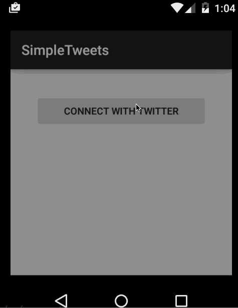

Twitter android client
[X] User can sign in to Twitter using OAuth login
[X] User can view the tweets from their home timeline
[X] User should be displayed the username, name, and body for each tweet
[X] User should be displayed the relative timestamp for each tweet "8m", "7h"
[X] User can compose a new tweet
[X] User can click a “Compose” icon in the Action Bar on the top right
[X] User can then enter a new tweet and post this to twitter
[X] User is taken back to home timeline with new tweet visible in timeline
[X] Links in tweets are clickable and will launch the web browser (see autolink)

